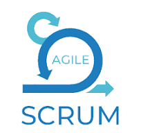

<h1 align="center">
  
</h1>

- 🏛️ Hi, I'm Michael O'Connor, a passionate MERN stack developer with expertise in HTML, CSS, React, EJS, Node.js, Express, and MongoDB.
- 💡 I love writing code and solving new and challenging problems!
- 💻 I’m looking for new career opportunities.
- 🔭 I am working on building a strong portfolio and peer network.
- 🌱 Currently learning Java and pursuing new certificates!
- 💬 Ask me about my projects!
- 📫 How to reach me: oconnorm0813@gmail.com
- 🖥️ Linkedin: [Michael O'Connor](https://www.linkedin.com/in/michael-o-connor-b79005200/)
- 🏌️‍♂️ Fun fact: I have played in a golf league for 8 years.
- 🏈 Go Bengals and Bucks!! 🐯

<h2 align="center">🔥 Languages & Frameworks & Tools & Abilities 🔥</h2><be>

  
  
  
  
  
  
  
  
  
  
  
  
  

